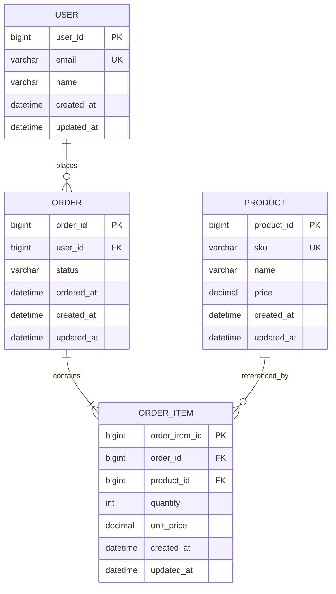

# DB設計書テンプレート（Markdown）

## 0. ドキュメント情報
- プロジェクト名:
- 対象システム:
- 版:
- 作成日:
- 作成者:
- 入力資料:
  - 要件定義書:
  - 基本設計書:
  - 詳細設計書:

## 1. 設計方針
- 設計原則（正規化方針、整合性方針）
- 命名規約（テーブル/カラム/制約/インデックス）
- 監査方針（作成者・更新者・日時）
- 削除方針（物理削除/論理削除）

## 2. エンティティ一覧
| 論理名 | 物理名 | 概要 | 主キー | 更新頻度 |
|---|---|---|---|---|

## 3. ER図（Mermaid）

## 4. テーブル詳細
### 4.1 {table_name}
- 論理名:
- 概要:
- 主キー:
- 外部キー:
- 一意制約:
- インデックス:
- 備考:

| カラム論理名 | カラム物理名 | 型 | 桁 | NULL | 既定値 | 制約 | 説明 |
|---|---|---|---|---|---|---|---|

## 5. 関係・整合性ルール
- 親子関係
- 参照整合性（ON DELETE / ON UPDATE）
- 業務制約（チェック制約、重複禁止）

## 6. トランザクション設計
- 代表ユースケース別の更新順序
- ロック戦略
- 冪等性方針

## 7. 性能設計
- 想定件数
- ボトルネック候補
- インデックス設計
- パーティション/アーカイブ方針

## 8. セキュリティ・監査
- 個人情報/機微情報の扱い
- マスキング/暗号化対象
- 監査ログ要件

## 9. 移行・運用
- 初期データ
- マイグレーション方針
- バックアップ/リストア観点

## 10. トレーサビリティ
| 上流ID | 種別（REQ/BSC/DET） | DB設計要素 | 反映内容 |
|---|---|---|---|

## 11. 未確定事項
- [TBD] 項目名: 確認先 / 期限 / 影響範囲
